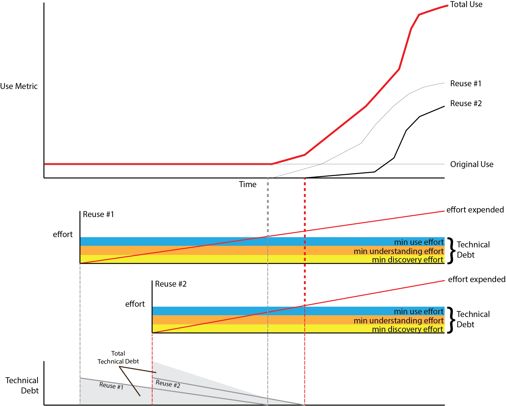

% Agile Data Curation - Technical Debt Conceptual Model
% Karl Benedict\
University of New Mexico, College of University Libraries and Learning Sciences
% February 17, 2015

# Technical Debt - Integration into an agile curation conceptual model

The concept of *debt* in software development was introduced in 1992 by Ward Cunningham  in the context of the adoption of object-oriented principles in the development of financial software. In his formulation

> Shipping first time code is like going into debt. A little debt speeds development so long as it is paid back promptly with a rewrite. Objects make the cost of this transaction tolerable. The danger occurs when the debt is not repaid. Every minute spent on not-quite-right code counts as interest on that debt. {Cunningham, 1992 #2427, p. 30} 

Cunningham focused on the development flexibility that is gained by accepting some degree of technical debt that is understood to require repayment some time in the future.

With the emergence of agile software development methods based upon the principles and spirit of the *Manifesto for Agile Software Development*:

> We are uncovering better ways of developing
> software by doing it and helping others do it.
> Through this work we have come to value:

> *Individuals and interactions* over processes and tools

> *Working software* over comprehensive documentation

> *Customer collaboration* over contract negotiation

> *Responding to change* over following a plan

> That is, while there is value in the items on
> the right, we value the items on the left more.{Beck, 2001 #2428}

The tradeoffs presented in the *Manifesto* provide opportunities to accrue technical debt throughout an agile software development process that has been recognized as a challenge that must be addressed when adopting agile methods. As noted by dos Santos et al.

> Technical debt has been a central theme among researchers and practitioners in the last years as an alternative perspective for software development and maintenance decisions. It offers a real world metaphor which is naturally understandable by mose software stakeholders and serves as tool to evaluate the tradeoffs between proposed enhancements, corrective maintenance and technical/non-functional improvements. {dos Santos, 2013 #2426, p. 124}

As we consider the application of agile development models to the process of data curation, the concept of technical debt may prove useful when attempting to identify the requirements for and progress towards enabling reuse of research data for communities of users and uses beyond those for which data were initially collected or created. 

# Assumptions

The conceptual model developed here has the following assumptions embedded in it. It is envisioned that violations of these assumptions will tend to complicate the model, but wouldn't necessarily invalidate it. 

1. *Data products in use by the original community of users that created/collected those data are assumed to have no technical debt.* This assumption translates into a scenario where the effort required to make the data discoverable, understandable and usable to its creators has already been expended. A corollary to this is that there exists a group of initial users of a data product for whom those data are already serving some need. 

2. *Enabling reuse of a data product by a new community of users and/or a use for which those data products were not created requires additional effort.* While the level of effort required for a specific community or use will vary, some level of effort must be expended. 

3. *There is a minimum level of effort that must be expended before any defined reuse may take place.* Prior to the expenditure of this minimum effort reuse by a specified community for a defined purpose cannot take place. 

4. *Some additional effort may accelerate or increase the use of a data product within a specified community for a given use.* This effort is above and beyond that required for initiation of use ((3) above), and may reach a point of diminishing returns in terms of use when compared to effort. 

# Types of *Effort* that are considered

When considering the reusability of data products, several key dimensions (and examples of how those dimensions translate into more specific requirements) related to those products may be translated into *effort* required to enable reuse:

Discoverability
:    Metadata content that, when properly indexed and searched, enables members of a community of users to find the product and consider it for use
:    Availability of searchable metadata in locations that are accessible to and used by the intended community of users
:    The existence of search interfaces that the intended community of users understand and are capable of using
:    Machine readability of metadata and accessibility of search interfaces for integration into other applications and services

Understanding
:    Metadata content that allows potential users to understand suitability for purpose in the context of their anticipated use
:    Other documentation or training materials that enable potential users to gain sufficient understanding of specific data products to enable effective use

Use
:    Data products available in formats commonly used by the intended community and use
:    Data services available that are consistent with those that are used by the intended community
:    Data volume/size that is manageable by the intended community

# Illustration of the conceptual model

# References Cited